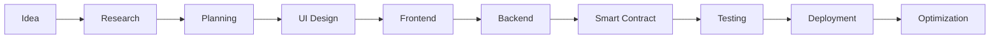

<!--
═══════════════════════════════════════════════════════════════

             Amir Ostowar GitHub Profile

Inspired by:
https://github.com/abhisheknaiidu/awesome-github-profile-readme

Skill Icons:
https://github.com/tandpfun/skill-icons

GitHub Stats:
https://github.com/anuraghazra/github-readme-stats

═══════════════════════════════════════════════════════════════
-->

<h1 align="center">

Hi 👋 I'm Amir Ostowar

</h1>

<h3 align="center">

Web3 Full-Stack Developer • Smart Contract Engineer • Blockchain Enthusiast

</h3>

<p align="center">


</p>

<p align="center">


</p>

---

# 👨‍💻 About Me

I'm **Amir Ostowar**, a passionate **Web3 Full-Stack Developer** with more than **10 years of experience** building modern web applications.

My journey into software development began with **WordPress**, where I discovered the power of turning ideas into real digital products. That curiosity soon led me into **Frontend Development**, mastering JavaScript ecosystems and crafting fast, responsive user experiences.

As blockchain technology evolved, I found my real passion in decentralization. I transitioned into **Smart Contract Development**, explored DeFi protocols, NFT ecosystems, and eventually became a **Full-Stack Web3 Developer**, combining modern frontend frameworks with blockchain infrastructure.

Today I focus on building secure, scalable and production-ready decentralized applications that bridge Web2 usability with Web3 innovation.

### 🚀 What I'm doing

- 🔭 Building Full Stack Web3 Applications
- ⚡ Developing Smart Contracts
- 🌱 Learning advanced Solidity patterns
- 💡 Exploring Account Abstraction & Zero Knowledge
- 🤝 Open for collaboration
- ❤️ Open Source supporter

---

# ⚡ Skill Stack

<p align="center">


</p>

### Blockchain

- Solidity
- Ethers.js
- Web3.js
- Hardhat
- OpenZeppelin

### Networks

- Ethereum
- Base
- Arbitrum
- Optimism
- Polygon
- BNB Chain
- Avalanche
- Solana

---

# 🚀 Featured Projects

<table>

<tr>

<td align="center" width="33%">

<a href="#">


</a>

<br>

<b>DEX Platform</b>

<br>

<sub>

A decentralized exchange supporting token swaps, liquidity pools and farming.

</sub>

<br><br>

**Tech**

React • Solidity • Ethers.js • Tailwind

</td>

<td align="center" width="33%">

<a href="#">


</a>

<br>

<b>NFT Marketplace</b>

<br>

<sub>

Mint, Buy, Sell and Auction NFTs with royalty support.

</sub>

<br><br>

**Tech**

Next.js • Solidity • IPFS • MongoDB

</td>

<td align="center" width="33%">

<a href="#">


</a>

<br>

<b>DAO Platform</b>

<br>

<sub>

Community governance with proposals and decentralized voting.

</sub>

<br><br>

**Tech**

React • Solidity • PostgreSQL

</td>

</tr>

</table>

<table>

<tr>

<td align="center">

<a href="#">


</a>

<br>

<b>Token Launchpad</b>

<br>

<sub>

Launch new blockchain projects with vesting, whitelist and token sale.

</sub>

<br><br>

**Tech**

Next.js • Solidity • Redis • Supabase

</td>

</tr>

</table>

# 📊 GitHub Analytics

<p align="center">


</p>

<p align="center">


</p>

---

# 📈 Contribution Graph

<p align="center">


</p>

---

# 🏆 GitHub Achievements

<p align="center">


</p>

---

# ⚙️ Development Philosophy

```typescript
const amir = {
    role: "Web3 Full-Stack Developer",

    experience: "10+ Years",

    focus: [
        "Smart Contracts",
        "Full Stack dApps",
        "DeFi",
        "NFT",
        "Blockchain Infrastructure"
    ],

    frontend: [
        "React",
        "Next.js",
        "TypeScript",
        "Tailwind CSS"
    ],

    blockchain: [
        "Solidity",
        "Ethers.js",
        "Web3.js",
        "Ethereum"
    ],

    backend: [
        "Node.js",
        "PostgreSQL",
        "MongoDB",
        "Redis",
        "Supabase"
    ],

    philosophy: "Write Clean Code • Build Useful Products • Never Stop Learning"
}
```

---

# 🌐 Blockchain Ecosystem

| Network | Experience |
|----------|-----------|
| Ethereum | ⭐⭐⭐⭐⭐ |
| Base | ⭐⭐⭐⭐⭐ |
| Arbitrum | ⭐⭐⭐⭐ |
| Optimism | ⭐⭐⭐⭐ |
| Polygon | ⭐⭐⭐⭐ |
| BNB Chain | ⭐⭐⭐⭐ |
| Avalanche | ⭐⭐⭐ |
| Solana | ⭐⭐⭐ |

---

# 💼 Services

✔ Smart Contract Development

✔ Full Stack dApps

✔ DeFi Applications

✔ NFT Marketplace Development

✔ Token Launchpad

✔ DAO Platforms

✔ Wallet Integration

✔ Web3 Authentication

✔ Frontend Development

✔ Backend APIs

✔ Blockchain Consulting

✔ Performance Optimization

---

# 📚 Currently Learning

- 🔹 Account Abstraction (ERC-4337)

- 🔹 Zero Knowledge Proofs (ZK)

- 🔹 Layer 2 Scaling

- 🔹 Cross-chain Protocols

- 🔹 Solidity Security Patterns

- 🔹 Advanced Smart Contract Auditing

---

# 📫 Connect With Me

<p align="center">

<a href="https://www.linkedin.com/in/amirostowar/">


</a>

&nbsp;&nbsp;

<a href="https://t.me/amir_3oa">


</a>

&nbsp;&nbsp;

<a href="mailto:info@ostodev.com">


</a>

</p>

---

# ☕ Fun Facts

- 🚀 Passionate about Web3 Innovation
- 💻 Building products from idea to deployment
- 🔥 Love solving challenging engineering problems
- 🌍 Open Source Contributor
- 📖 Lifelong Learner
- ⚡ Coffee + Music + Code

---

# 🚀 2026 Goals

- ✅ Build production-ready Web3 products
- 🔥 Contribute more to Open Source
- 🌍 Collaborate with global blockchain teams
- 📚 Deep dive into Zero Knowledge Proofs
- ⚡ Master Account Abstraction (ERC-4337)
- 🏗 Build scalable DeFi infrastructure
- 🛡 Learn Smart Contract Auditing
- 🤝 Mentor junior blockchain developers

---

# ❤️ Favorite Technologies

<p align="center">


</p>

---

# ⚡ Tech Highlights

<table>

<tr>

<td align="center">

<h3>Frontend</h3>

React<br>
Next.js<br>
TypeScript<br>
TailwindCSS<br>
Redux

</td>

<td align="center">

<h3>Backend</h3>

Node.js<br>
Express<br>
MongoDB<br>
PostgreSQL<br>
Redis

</td>

<td align="center">

<h3>Blockchain</h3>

Solidity<br>
Hardhat<br>
Web3.js<br>
Ethers.js<br>
OpenZeppelin

</td>

</tr>

</table>

---

# 📊 Coding Activity

<p align="center">


</p>

<p align="center">


</p>

---

# ⛓ Blockchain Focus

```text
Ethereum      ████████████████
Base          ██████████████
Arbitrum      █████████████
Polygon       ████████████
Optimism      ███████████
BNB Chain     ██████████
Avalanche     ████████
Solana        ███████
```

---

# 🧠 Development Mindset

> Build products that solve real problems.

> Keep learning.

> Keep shipping.

> Keep improving.

---

# 🐍 Contribution Snake

> ⚠️ ابتدا این GitHub Action را در ریپازیتوری خودت فعال کن، سپس تصویر زیر به‌صورت خودکار نمایش داده می‌شود.

<p align="center">


</p>

---

# 💻 Daily Workflow

```text
☕ Coffee
      ↓
📖 Research
      ↓
⌨️ Code
      ↓
🧪 Test
      ↓
🚀 Deploy
      ↓
🔁 Repeat
```

---

# 🌎 Let's Build Web3 Together

If you're building something exciting in the blockchain ecosystem,
I'm always interested in collaborating on innovative ideas,
open-source projects, and scalable decentralized applications.

---

# 💬 Favorite Quote

> "First, solve the problem. Then, write the code."

— John Johnson

---

# ⚙️ Environment

```yaml
OS: Linux / Windows

Editor: VS Code

Terminal: Bash

Browser: Brave

Version Control: Git

Cloud: Vercel

Database:
  - PostgreSQL
  - MongoDB
  - Redis
  - Supabase

Blockchain:
  - Ethereum
  - Base
  - Polygon
  - Arbitrum
```

---

# ☕ Support

If you enjoy my work, don't forget to ⭐ my repositories.

---

# 📌 Featured Repositories

<p align="center">

<a href="https://github.com/amirostowar">

</a>

<a href="https://github.com/amirostowar">

</a>

</p>

<p align="center">

<a href="https://github.com/amirostowar">

</a>

<a href="https://github.com/amirostowar">

</a>

</p>

> **نکته:** نام `repo=` را بعداً با نام واقعی مخزن‌هایت جایگزین کن.

---

# 📖 Philosophy

```text
Write code that is clean.
Build products that matter.
Think decentralized.
Never stop learning.
```

---

# 🔥 My Development Process



---

# 📈 Contribution Calendar

<p align="center">


</p>

---

# 🌍 Open Source

I believe open source drives innovation.

Whenever possible, I contribute to projects, share knowledge, and build software that helps developers and businesses adopt decentralized technologies.

---

# 🤝 Collaboration

I'm always interested in collaborating on:

- Web3 Startups

- DeFi Platforms

- DAO Infrastructure

- NFT Ecosystems

- Blockchain APIs

- Full Stack Applications

- Developer Tools

---

# 📬 Contact

<p align="center">

<a href="mailto:info@ostodev.com">


</a>

<a href="https://www.linkedin.com/in/amirostowar/">


</a>

<a href="https://t.me/amir_3oa">


</a>

</p>

---

# ⚡ Fun Facts

```yaml
Name: Amir Ostowar

Role: Web3 Full-Stack Developer

Experience: 10+ Years

Favorite Language: TypeScript

Favorite Chain: Ethereum

Coffee: Required ☕

Music While Coding: Always 🎧

Mission:
Build scalable decentralized applications.
```

---

# 🎯 Current Focus

- Smart Contract Architecture

- Full Stack dApps

- Security Best Practices

- Gas Optimization

- Layer 2 Ecosystem

- AI + Blockchain

---

# 🛠 Toolbox

```text
Frontend
███████████████████████

Backend
██████████████████

Blockchain
████████████████████████

DevOps
██████████████

Database
███████████████████
```

---

# ❤️ Thanks for Visiting

<p align="center">

If you like my work,

consider giving a ⭐ to my repositories.

</p>

<p align="center">

Happy Coding 🚀

</p>

---

<p align="center">


</p>
