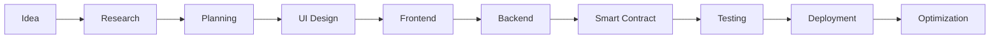

<h1 align="center">
Hi 👋 I'm Amir Ostowar
</h1>

<h3 align="center">
Web3 Full-Stack Developer • Smart Contract Engineer • Blockchain Enthusiast
</h3>

# 👨‍💻 About Me

I'm **Amir Ostowar**, a passionate **Web3 Full-Stack Developer** with more than **10 years of experience** building modern web applications.

My journey into software development began with **WordPress**, where I discovered the power of turning ideas into real digital products. That curiosity soon led me into **Frontend Development**, mastering JavaScript ecosystems and crafting fast, responsive user experiences.

As blockchain technology evolved, I found my real passion in decentralization. I transitioned into **Smart Contract Development**, explored DeFi protocols, NFT ecosystems, and eventually became a **Full-Stack Web3 Developer**, combining modern frontend frameworks with blockchain infrastructure.

Today I focus on building secure, scalable and production-ready decentralized applications that bridge Web2 usability with Web3 innovation.

### 🚀 What I'm doing

- 🔭 Building Full Stack Web3 Applications
- ⚡ Developing Smart Contracts
- 🌱 Learning advanced Solidity patterns
- 💡 Exploring Account Abstraction & Zero Knowledge
- 🤝 Open for collaboration
- ❤️ Open Source supporter

---

# ⚡ Skill Stack

---

# 🚀 Featured Projects

<table>

<tr>

<td align="center" width="33%">

 

<b>DEX Platform</b>

 

A decentralized exchange supporting token swaps

  

**Tech**

React • Solidity • Ethers.js • Tailwind

</td>

<td align="center" width="33%">

 

<b>NFT Marketplace</b>

 

Sell and Auction NFTs with royalty support.

  

**Tech**

Next.js • Solidity • IPFS • MongoDB

</td>

<td align="center" width="33%">

 

<b>DAO Platform</b>

 

Community governance with proposals 

 

**Tech**

React • Solidity • PostgreSQL

</td>

---

# 🔥 My Development Process

---

# 📫 Contact

<a href="https://www.linkedin.com/in/amirostowar/">

